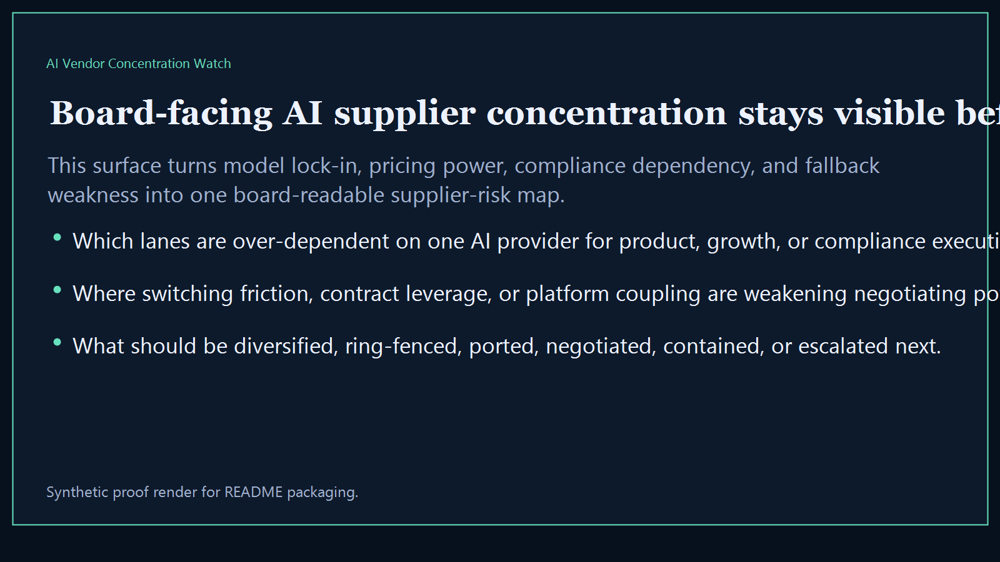
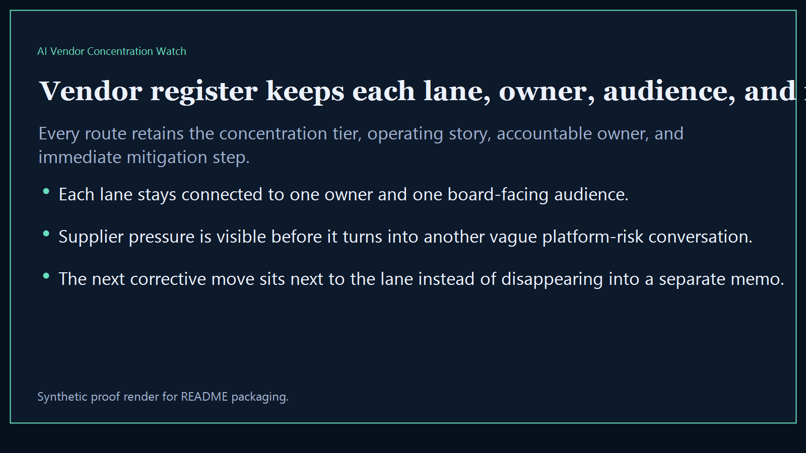
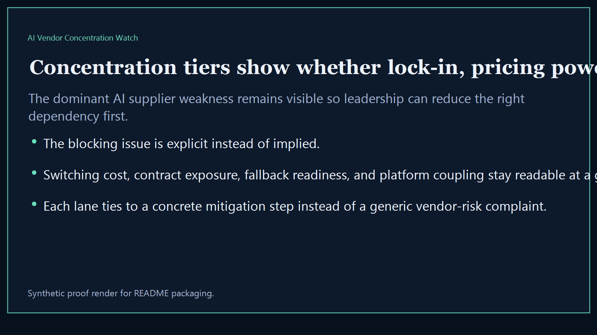
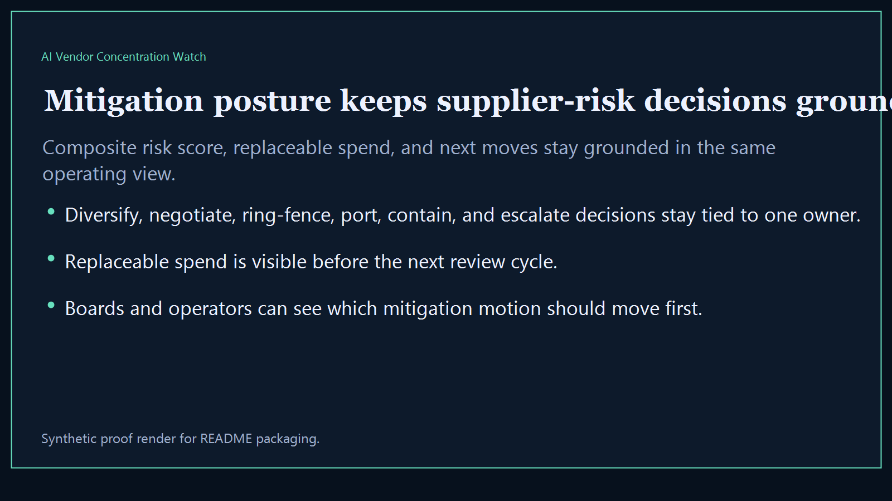

# AI Vendor Concentration Watch

Board-ready executive-intelligence surface for exposing AI vendor concentration, dependency risk, switching pressure, and board-visible supplier exposure across the broader Kinetic Gain suite.

- Live: `https://vendors.kineticgain.com/`
- Repo: `mizcausevic-dev/ai-vendor-concentration-watch`

## Why this matters

Leaders need one AI vendor watch that shows where supplier concentration is rising, where switching pressure is growing, and which dependencies deserve intervention before the next board or investor review.

## What it includes

- TypeScript executive-intelligence surface for tracking AI vendor concentration, supplier overlap, and dependency pressure
- synthetic lanes across multiple sectors, owner groups, and board-visible supplier-risk failures
- reusable outputs for vendor register, concentration tiers, mitigation posture, and board-ready dependency narratives
- prerendered static site, JSON payloads, screenshots, and docs

## Routes

- `/`
- `/vendor-register`
- `/concentration-tiers`
- `/mitigation-posture`
- `/verification`
- `/docs`

## Local run

```bash
cd ai-vendor-concentration-watch
npm install
npm run verify
npm run prerender
npm run render:assets
```

## CLI

```bash
npx ai-vendor-concentration-watch fixtures/ai-vendor-concentration-watch.json --format summary
npx ai-vendor-concentration-watch fixtures/ai-vendor-concentration-watch-clean.json --format json
```

## Docs

- [Architecture](docs/architecture.md)
- [Origin](docs/ORIGIN.md)
- [Kinetic Gain Embedded](docs/KINETIC_GAIN_EMBEDDED.md)

## Screenshots





